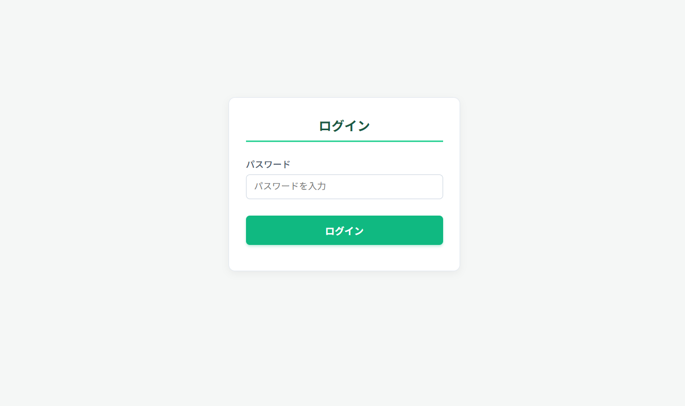
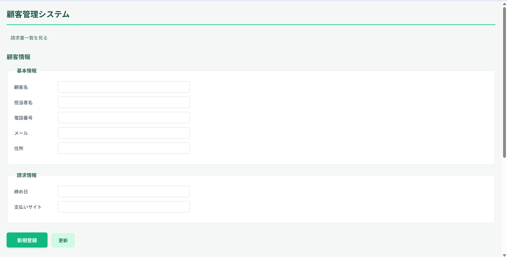
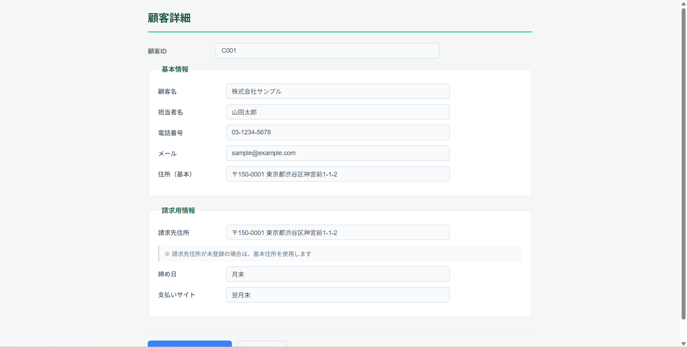
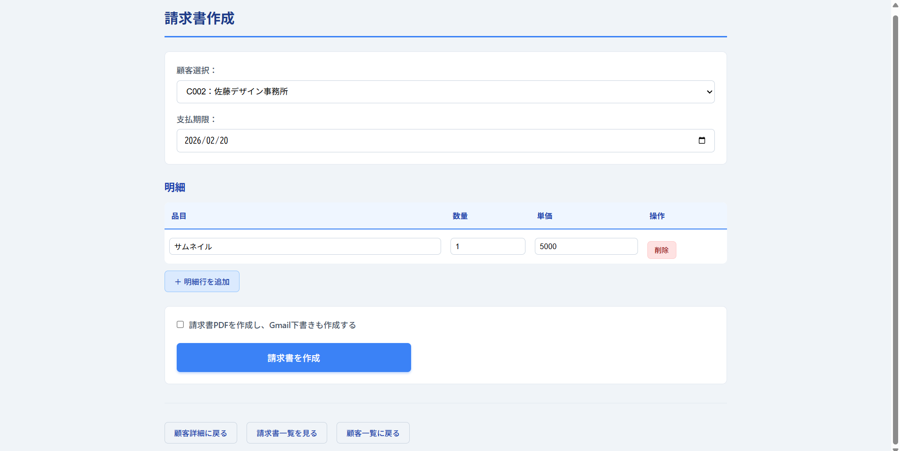
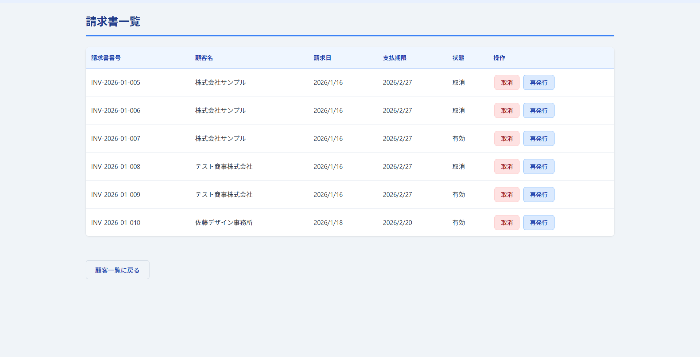

# 🏢 GAS顧客管理＆請求書発行システム

> 個人・小規模事業者の業務効率化を実現する、Google Apps Scriptベースの統合管理システム

[](https://script.google.com)
[](https://sheets.google.com)
[](https://opensource.org/licenses/MIT)

---

## 📢 重要なお知らせ

**このリポジトリはポートフォリオ用です**

- 本システムは将来的な**サービス商品化を検討中**のため、ソースコードは非公開としています
- このREADMEとスクリーンショットで、システムの概要・機能・開発思想をご確認いただけます
- **導入・カスタマイズのご相談は個別に承ります**（詳細は[こちら](#-ご相談お問い合わせ)）

**もし興味を持っていただけましたら**

- システム導入のご相談
- カスタマイズのご依頼
- 類似システムの開発依頼
- その他業務自動化のご相談

お気軽にお問い合わせください！

---

## 📖 目次

- [プロジェクト概要](#-プロジェクト概要)
- [なぜこのシステムを作ったのか](#-なぜこのシステムを作ったのか)
- [主な機能](#-主な機能)
- [技術スタック](#-技術スタック)
- [システムの特徴](#-システムの特徴)
- [画面イメージ](#-画面イメージ)
- [対応規模](#-対応規模)
- [このシステムで解決できる課題](#-このシステムで解決できる課題)
- [開発者について](#-開発者について)
- [ご相談・お問い合わせ](#-ご相談お問い合わせ)

---

## 🎯 プロジェクト概要

**「顧客管理」と「請求書発行」を一つのシステムで完結**

個人事業主や小規模事業者向けに、**Googleアカウントだけで導入できる**顧客管理・請求書発行システムです。従来、スプレッドシートやExcelで手動管理していた業務を自動化し、事務作業の負担を大幅に軽減します。

### 解決する課題

- ❌ スプレッドシートでの顧客管理は見づらく、探しづらい
- ❌ 請求書作成→PDF化→フォルダ保存→メール送信の手作業が面倒
- ❌ 顧客数が増えると管理が煩雑になる
- ❌ 有料の業務管理ソフトは導入コストが高い

### このシステムなら

- ✅ **検索機能**で顧客情報をすぐに見つけられる
- ✅ **ワンクリック**で請求書PDF作成＆自動保存
- ✅ **Gmail下書き**も自動作成で送信がスムーズ
- ✅ **完全無料**でGoogleアカウントだけで導入可能

---

## 💡 なぜこのシステムを作ったのか

### 開発の背景

私自身が個人事業主として活動する中で、「顧客情報の管理」と「請求書発行」の作業が地味に負担だと感じていました。

前職で金融機関の顧客管理システムを使っていた経験から、
**「個人事業主でも企業のようなシステムがあれば便利なのに」**
という思いがありました。

### よくある困りごと

- 「この担当者さん、どこの会社だっけ？」
- 「株式会社〇〇？〇〇株式会社？どっちだっけ？」
- スプレッドシートの小さなマスで見づらい、探しづらい
- 請求書を毎回手作業で作って、フォルダに保存して、メール添付して...

**こうした「小さいけれど毎回発生する手間」を自動化したい**という思いから、このシステムを開発しました。

---

## ✨ 主な機能

### 1. 顧客管理機能

| 機能 | 説明 |
|------|------|
| **顧客情報登録** | 顧客名、担当者、連絡先、住所などを一元管理 |
| **顧客ID自動採番** | C001形式で自動採番（手動入力不要） |
| **検索機能** | 企業名・担当者名・電話番号で部分一致検索 |
| **顧客詳細表示** | 登録情報を見やすい画面で確認・編集 |
| **情報更新・削除** | 顧客情報の編集・削除が簡単操作 |

### 2. 請求書発行機能

| 機能 | 説明 |
|------|------|
| **請求書自動作成** | テンプレートから請求書を自動生成 |
| **請求書番号自動採番** | INV-2026-01-001形式で自動採番 |
| **PDF自動生成** | スプレッドシートから自動でPDF化 |
| **フォルダ自動保存** | 顧客別フォルダを自動作成して保存 |
| **Gmail下書き作成** | 請求書PDFを添付したメール下書きを自動作成（任意） |
| **請求書一覧管理** | 発行済み請求書の一覧表示・検索 |
| **請求書再発行** | 修正が必要な場合の再発行機能（元の請求書は取消状態に） |
| **支払状況管理** | 未振込・振込済の状態管理 |

### 3. セキュリティ機能

| 機能 | 説明 |
|------|------|
| **パスワード認証** | システムアクセス時の認証機能 |
| **セッション管理** | ログイン状態の管理 |

---

## 🛠 技術スタック

### 使用技術

```
フロントエンド
├─ HTML5
├─ CSS3
└─ JavaScript (ES6+)

バックエンド
└─ Google Apps Script (GAS)

データベース
└─ Google スプレッドシート

ストレージ
└─ Google Drive

メール連携
└─ Gmail API (GAS経由)

認証
└─ GAS Script Properties
```

### なぜGoogle Apps Scriptを選んだのか

1. **導入コストゼロ** - Googleアカウントがあれば誰でも無料で使える
2. **運用が簡単** - サーバー管理不要、メンテナンスフリー
3. **API連携が容易** - Google Workspace（スプレッドシート、Drive、Gmail）との連携がスムーズ
4. **小規模事業者に最適** - 初期コストをかけずに本格的なシステムが構築できる

---

## 🌟 システムの特徴

### 業務フローの最適化

従来の手作業フローと、このシステムでの自動化フローを比較：

#### 従来の作業（手作業）

```
1. スプレッドシートで顧客情報を探す（スクロール、検索）
2. 請求書テンプレートを開く
3. 顧客情報を手入力（コピペ）
4. 明細を入力
5. 金額計算（電卓 or 手動入力）
6. PDF化（ファイル→ダウンロード→PDF）
7. ファイル名を変更
8. Google Driveのフォルダを探す
9. フォルダに保存
10. Gmailを開く
11. 宛先、件名、本文を入力
12. PDFを添付
13. 送信 or 下書き保存

所要時間：約5〜10分/件
```

#### このシステムでの作業（自動化）

```
1. 顧客一覧から「請求書作成」をクリック
2. 明細を入力
3. 「請求書を作成」をクリック
   ↓
   【以下すべて自動処理】
   ・請求書番号の自動採番
   ・テンプレートへの自動反映
   ・PDF化
   ・顧客別フォルダの自動作成
   ・フォルダへの自動保存
   ・Gmail下書き作成（任意）

所要時間：約1〜2分/件
```

**→ 約70〜80%の時間削減を実現**

### 実装時の工夫ポイント

#### 1. ユーザビリティの追求

- 画面付きシステムで**入力ミスを防止**
- スプレッドシートの狭いマスより**見やすく、入力しやすい**UI設計
- 部分一致検索で**素早く顧客を特定**

#### 2. 柔軟な運用設計

- Gmail下書き作成は**任意選択式**
  - 理由：ユーザーによって業務フローが異なるため
  - 例：メールで送る人、PDFを別の方法で送る人など
  
#### 3. データの正確性確保

- 顧客ID・請求書番号の**自動採番**で入力ミス防止
- 請求書再発行時は**元の請求書を取消状態**にして履歴を保持
- 金額計算の**自動化**で計算ミス防止

#### 4. 拡張性の考慮

- 顧客情報の項目は**必要最低限**に設定
  - 理由：使いやすさ優先、将来的に追加可能な設計
- テンプレートは**カスタマイズ可能**
  - 理由：業種や好みに応じて変更できる柔軟性

---

## 📸 画面イメージ

### ログイン画面

*セキュリティ対策としてパスワード認証を実装*

### 顧客管理画面（トップページ）

*顧客情報の登録・検索・一覧表示*

### 顧客詳細画面

*見やすい画面で顧客情報を確認・編集*

### 請求書作成画面

*明細入力から自動PDF化まで一画面で完結*

### 請求書一覧画面

*発行済み請求書の管理・支払状況の確認*

---

## 📊 対応規模

### 推奨利用規模

| 項目 | 推奨範囲 | パフォーマンス |
|------|----------|----------------|
| 顧客数 | **50〜200件** | 検索：1〜3秒 |
| 月間請求書発行数 | **10〜50件** | 作成：5〜15秒/件 |
| ユーザー数 | **1〜3名** | 同時操作可能 |

### パフォーマンス実測値

| 顧客数 | 検索速度 | 請求書作成速度 | 推奨度 |
|--------|----------|----------------|--------|
| 〜50件 | 非常に速い（1秒未満） | 非常に速い（5秒未満） | ⭐⭐⭐⭐⭐ |
| 50〜100件 | 速い（1〜2秒） | 速い（5〜10秒） | ⭐⭐⭐⭐ |
| 100〜200件 | 普通（2〜3秒） | 普通（10〜15秒） | ⭐⭐⭐ |
| 200〜300件 | やや遅い（3〜5秒） | やや遅い（15〜20秒） | ⭐⭐ |

---

## 💼 このシステムで解決できる課題

### こんな方におすすめ

✅ **スプレッドシートやExcelで顧客管理している個人・小規模事業者**
- 顧客数が増えてきて、管理が煩雑になってきた
- 顧客情報を探すのに時間がかかる

✅ **毎月複数の請求書を発行している方**
- 請求書作成→PDF化→保存→メール送信の繰り返しが面倒
- 請求書のファイル管理が煩雑

✅ **業務効率化したいけど、何から始めればいいか分からない方**
- 日々の作業を自動化したいけど、方法が分からない
- システム導入にコストをかけられない

### 向いている業種（例）

- 動画編集者・クリエイター
- Webデザイナー・エンジニア
- コンサルタント
- 士業（税理士、行政書士など）
- その他、BtoB取引のある個人・小規模事業者

---

## 👤 開発者プロフィール

### 🎯 私が大切にしていること

**「技術で課題を解決し、日々の業務を楽にする」**

プログラミング未経験からAIエンジニアを目指して学習を開始。現在は実務案件にチャレンジしながら、**実装経験を通して成長を続けています**。

コードが完璧に書けなくても、**AIと協力しながら実用的なシステムを作り上げる**ことができる──それが私の強みです。

### 💼 バックグラウンド

**前職：金融機関勤務**
- 顧客管理システムの日常的な利用経験
- データの正確性・セキュリティの重要性を理解
- 業務効率化の視点を習得

**現在：個人事業主 × AIエンジニア学習中**
- 動画編集からシステム開発まで幅広く対応
- クライアントワークを通じて実務感覚を磨く
- 小規模事業者の課題を肌で感じながら開発

### 🛠 スキルセット

#### 開発スキル

**メイン技術**
```
Google Apps Script (GAS) ⭐⭐⭐⭐
├─ スプレッドシート連携
├─ Gmail / Drive API連携
├─ Webアプリ開発
└─ 業務自動化スクリプト

JavaScript ⭐⭐⭐
├─ フロントエンド実装
├─ DOM操作
└─ 非同期処理

HTML/CSS ⭐⭐⭐
└─ レスポンシブデザイン
```

**学習中・拡張予定**
```
Python
├─ データ分析
└─ AI/機械学習

その他
├─ React（今後学習予定）
└─ データベース設計
```

#### 業務スキル

- **要件定義・課題整理**
  - クライアントの「なんとなく困っている」を言語化
  - 業務フローの可視化と課題抽出
  - 優先順位をつけた改善提案

- **ユーザー視点の設計**
  - ITが得意でない方でも使えるUI/UX設計
  - 操作マニュアルの作成
  - 導入後のサポート

- **プロジェクト管理**
  - 小規模案件の進行管理
  - スケジュール調整
  - 適切な報告・連絡・相談

### 🌟 開発スタンス

#### 1. **課題解決ファースト**

技術ありきではなく、**「何を解決するか」**から考えます。

```
❌ 「この技術を使って何か作りたい」
✅ 「この課題を解決するために最適な技術を選ぶ」
```

実際の業務フローを理解し、本当に必要な機能だけを実装。過剰な機能は作りません。

#### 2. **実用性重視の設計**

使いやすさ、分かりやすさを第一に。

- 専門用語を使わない画面設計
- 迷わない操作フロー
- エラーが起きにくい仕組み

「ちょうどいい」システムを目指します。

#### 3. **AI活用による効率的な開発**

プログラミング未経験からのスタートですが、**AIツールを積極的に活用**することで：

- 要件を正確に伝え、実装に落とし込む
- コードの意図を理解し、必要に応じて調整
- エラー対応やデバッグを効率的に実施

「AIに任せっきり」ではなく、**「AIと協力して作り上げる」**スタイルです。

#### 4. **継続的な改善とコミュニケーション**

- 実際に使ってみて気づいた点を改善
- クライアントのフィードバックを真摯に受け止める
- 定期的な進捗報告と相談

**「作って終わり」ではなく、「育てていく」**開発を心がけています。

### 🎓 学習姿勢

**継続的な学習を重視**

```
現在の学習フロー：
実務案件 → 課題発見 → 学習・調査 → 実装 → 改善
```

- プログラミング未経験からPythonでAIエンジニア学習を開始
- GASを中心に実務案件で実装経験を積む
- JavaScript、今後React等も学習予定
- 言語そのものは読めなくても、**AIに要件を伝えて実装できる力**を強化中

**「分からないことを分からないままにしない」**

- 公式ドキュメントを読む習慣
- 実装の意図を理解するまで調査
- 必要に応じて専門家に相談

### 📊 開発実績

**このプロジェクト：GAS顧客管理＆請求書発行システム**

- 開発期間：約2週間
- 主な技術：GAS、JavaScript、HTML/CSS
- 機能数：10以上の主要機能
- 解決した課題：手作業での顧客管理・請求書発行業務の自動化（作業時間70〜80%削減）

**その他の自動化案件（進行中）**

- スプレッドシート連携による業務効率化
- Gmail自動送信システム
- データ集計・分析の自動化

### 💪 私の強み

#### ユーザー視点での開発

金融機関での顧客管理システム利用経験から：

- どういう機能があると便利か
- どんな項目が必要か  
- どういう画面設計が使いやすいか

といった**エンドユーザーの視点**を開発に活かせます。

#### 小規模事業者の気持ちが分かる

自身が個人事業主として活動しているため：

- 限られた予算での開発の重要性
- 本業が忙しい中でのシステム導入の大変さ
- 「完璧」より「実用的」を求める気持ち

これらを理解した上で、**現実的な提案**ができます。

#### 丁寧なコミュニケーション

- 専門用語を使わない説明
- 図解やスクリーンショットでの分かりやすい報告
- レスポンスの早さ
- 「こうしたい」を一緒に言語化するサポート

**ITが得意でない方でも安心してご依頼いただける**対応を心がけています。

### 📊 開発実績

**このプロジェクト：GAS顧客管理＆請求書発行システム**

- 開発期間：約2週間
- 主な技術：GAS、JavaScript、HTML/CSS
- 機能数：10以上の主要機能
- 解決した課題：手作業での顧客管理・請求書発行業務の自動化（作業時間70〜80%削減）

**その他の自動化案件（進行中）**

- スプレッドシート連携による業務効率化
- Gmail自動送信システム
- データ集計・分析の自動化

### 💼 こんな方のご相談に対応できます

✅ **「困っているけど、うまく説明できない」という方**
- 業務の何が問題か言語化が難しい
- システム化したいけど要件が整理できていない
→ 一緒にヒアリングしながら課題を整理します

✅ **初めて外注する・システム開発が初めての方**
- 専門用語が分からない
- 何を伝えればいいか分からない
→ 分かりやすい言葉で丁寧にコミュニケーションします

✅ **予算が限られている小規模事業者の方**
- できるだけコストを抑えたい
- 必要最小限から始めたい
→ 段階的な開発で小さく始められます

✅ **長く使えるシステムを求めている方**
- 作って終わりではなく、改善を重ねたい
- 運用しながら育てていきたい
→ 継続的なサポートも可能です

✅ **Googleサービスを使っている方**
- スプレッドシート、Gmail、Driveを日常的に使用
- 既存の環境を活かして効率化したい
→ Google Workspaceとの連携が得意です

---

## 📞 ご相談・お問い合わせ

### 💬 まずは気軽にご相談ください

**「こんなこと相談していいのかな？」と思われることでも大歓迎です**

よくいただくご相談：

- 💭 「日々の作業を楽にしたいけど、何が自動化できるか分からない」
- 🔧 「このシステムを自社の業務に合わせてカスタマイズしたい」
- 📋 「似たようなシステムを作ってほしい」
- 🌱 「小さな自動化から始めたい」
- ❓ 「スプレッドシートでの管理に限界を感じている」

### 📝 ご相談の流れ

```
1. お問い合わせ
   ↓
   現状の業務内容をヒアリング
   ・どんな業務をされているか
   ・普段使っているツールは何か
   ・どの作業に手間を感じているか
   
2. 課題の整理（無料）
   ↓
   一緒に課題を言語化
   ・本当に解決したい課題は何か
   ・優先順位はどうか
   ・予算感はどれくらいか
   
3. ご提案
   ↓
   最適なソリューションをご提案
   ・実現可能な方法
   ・開発期間の目安
   ・お見積り
   
4. 開発スタート
   ↓
   段階的に開発・テスト・改善
```

### 💰 料金の目安

**基本方針：小規模事業者様でも導入しやすい価格設定**

| 案件規模 | 参考価格 | 期間 | 内容例 |
|---------|---------|------|--------|
| **小規模自動化** | ¥30,000〜¥50,000 | 3日〜1週間 | スプレッドシート自動化、Gmail自動送信など |
| **システム導入支援** | ¥80,000〜¥150,000 | 1〜2週間 | 本システムの導入・カスタマイズ |
| **カスタム開発** | ¥150,000〜 | 2週間〜 | オリジナルシステム開発 |
| **保守・サポート** | 月額¥10,000〜 | 継続 | 運用サポート、改善対応 |

※クラウドソーシングサイトでのご依頼を想定した価格です  
※あくまで目安です。詳細はヒアリング後にお見積りいたします  
※予算に応じて段階的な開発も可能です

### 🎁 初回特典

**初めてご依頼いただく方限定**

- ✅ 課題ヒアリング・整理（無料）
- ✅ 簡易的な改善提案（無料）
- ✅ 丁寧なコミュニケーションで安心サポート

まずは小さく始めて、効果を実感してからの拡張も大歓迎です。

💡 **今後の予定**  
実績を積み重ねた後、直接ご依頼の受付も開始予定です。その際はより柔軟な価格設定で対応できる見込みです。

### 🌟 こんな開発が得意です

#### 1. Google Workspace活用

- スプレッドシート連携システム
- Gmail自動送信・テンプレート管理
- Google Drive自動整理
- フォーム回答の自動処理

#### 2. 業務自動化

- 定型作業の自動化
- データ集計・レポート作成
- 請求書・見積書作成
- 顧客管理・案件管理

#### 3. 小規模Webアプリ

- 社内用管理画面
- 申請・承認フロー
- 簡易的な予約システム
- データ入力フォーム

### 📧 お問い合わせ方法

現在は**クラウドソーシングサイト経由でのご依頼を募集中**です。

**クラウドソーシングサイト**
- [ランサーズ](#):https://www.lancers.jp/profile/Mi1103
- [クラウドワークス](#):https://crowdworks.jp/public/employees/6463085?ref=share_url_wkprofile
- [ココナラ](#):https://coconala.com/users/5336527

💡 **クラウドソーシング経由のメリット**
- プラットフォームの評価・実績が確認できる
- トラブル時のサポートがある
- 支払い方法が確立されている
- 安心してご依頼いただけます

**ご依頼の流れ**
1. 各クラウドソーシングサイトでプロフィールを確認
2. メッセージでご相談内容をお送りください
3. ヒアリング後、お見積りをご提示
4. ご納得いただけましたら契約・開発スタート

※実績を積み重ねた後、直接ご依頼の受付も開始予定です

### ⏰ 対応時間

- 平日：9:00〜15:00
- 土日祝：応相談
- レスポンス：24時間以内を目指します

### 🤝 よくある質問（FAQ）

<details>
<summary><strong>Q. プログラミング未経験からの開発でも大丈夫ですか？</strong></summary>

**A.** はい、問題ありません。

私は最新のAIツールを活用しながら開発しており、要件を正確に理解し実装する力を重視しています。「コードを一から書く力」より「課題を解決する力」が重要だと考えています。

実際にこのシステムも、実用レベルで稼働しています。
</details>

<details>
<summary><strong>Q. 予算が限られているのですが...</strong></summary>

**A.** ご予算に応じて段階的な開発が可能です。

まずは「これだけは自動化したい」という部分から小さく始めて、効果を確認しながら拡張していくことをおすすめしています。

初回は¥5,000〜の小規模案件から承ります。
</details>

<details>
<summary><strong>Q. 導入後のサポートはありますか？</strong></summary>

**A.** はい、ございます。

- 導入時の操作説明
- マニュアル作成
- 運用開始後の質問対応（一定期間無料）
- 継続的な保守サポート（有料オプション）

「作って終わり」ではなく、安心して使い続けていただけるようサポートします。
</details>

<details>
<summary><strong>Q. 遠方でも対応可能ですか？</strong></summary>

**A.** はい、全国対応可能です。

- オンラインミーティング（Zoom、Google Meetなど）
- Gmail
- LINE（仕事用アカウント）

での進行で、遠方の方でも問題なく進められます。
</details>

<details>
<summary><strong>Q. このシステムをそのまま導入したいです</strong></summary>

**A.** 大歓迎です！

現在、本システムのサービス商品化を検討中です。導入ご希望の方には、個別に導入サポート（カスタマイズ含む）を承ります。

まずはお問い合わせください。
</details>

<details>
<summary><strong>Q. 機密情報を扱うのですが、セキュリティは大丈夫ですか？</strong></summary>

**A.** 機密保持契約（NDA）の締結も可能です。

- データは全てお客様のGoogleアカウント内で管理
- 開発者（私）は必要最小限のアクセス権のみ
- プロジェクト完了後はアクセス権を削除

セキュリティには十分配慮して開発いたします。
</details>

### 💼 対応可能な業種（実績・想定）

- 🎬 クリエイター（動画編集、デザイナーなど）
- 💻 IT・Web関連
- 📊 コンサルタント
- 🏛 士業（税理士、行政書士など）
- 🏪 小売・EC事業者
- 📚 教育・研修事業者
- 🏢 その他BtoB事業者

**業種問わず、「手作業での管理に困っている」方はご相談ください**

---

## 📝 このリポジトリについて

### ポートフォリオとしての位置づけ

このリポジトリは、私の**開発スキルと課題解決力を示すポートフォリオ**です。

**なぜコードを公開していないのか**

1. **将来的なサービス商品化を検討中**
   - 小規模事業者向けSaaSとしての提供を視野に
   - システムの独自性・価値を保護

2. **カスタマイズ前提での提供**
   - お客様ごとに業務フローが異なるため
   - 標準版よりカスタマイズ版での提供が最適

3. **導入サポート付きでの提供を想定**
   - 単なるコード提供でなく、導入支援込みのサービスに

**このREADMEで分かること**

- ✅ どんな課題を解決できるシステムか
- ✅ どういう技術で作られているか
- ✅ 開発者がどんな考え方で開発しているか
- ✅ 依頼した場合のイメージ

### リポジトリの構成

```
gas-customer-invoice-system/
├── README.md                    # このファイル（システム概要・開発者情報）
├── screenshots/                 # システムのスクリーンショット
│   ├── login.png               # ログイン画面
│   ├── customer_list.png       # 顧客管理画面
│   ├── customer_detail.png     # 顧客詳細画面
│   ├── invoice_create.png      # 請求書作成画面
│   └── invoice_list.png        # 請求書一覧画面
└── docs/                        # 補足ドキュメント（準備中）
    ├── FEATURES.md             # 機能詳細
    ├── WORKFLOW.md             # 業務フロー改善例
    └── FAQ.md                  # よくある質問
```

### 導入をご検討の方へ

**本システムの導入は以下の流れで進めます**

1. **ヒアリング**（無料）
   - 現状の業務フローを確認
   - 必要なカスタマイズを洗い出し

2. **お見積り**
   - 導入サポート費用
   - カスタマイズ費用
   - 保守サポート費用（オプション）

3. **導入支援**
   - Google Apps Scriptのセットアップ
   - スプレッドシート・フォルダの準備
   - カスタマイズ対応

4. **操作説明＆テスト運用**
   - マニュアル提供
   - 操作説明（オンライン）
   - 実際のデータでのテスト

5. **本稼働＆アフターサポート**
   - 質問対応（一定期間無料）
   - 継続的な改善提案

**標準的な導入期間：1〜2週間**  
**導入サポート費用：¥50,000〜¥100,000**（カスタマイズ内容により変動）

### ライセンスについて

- このREADMEおよびスクリーンショットは自由にご覧いただけます
- システム本体のコードは非公開です
- 導入・利用をご希望の方は個別にご相談ください

---

## 🔗 関連リンク

**クラウドソーシングサイト**
- [ランサーズ](#):https://www.lancers.jp/profile/Mi1103
- [クラウドワークス](#):https://crowdworks.jp/public/employees/6463085?ref=share_url_wkprofile
- [ココナラ](#):https://coconala.com/users/5336527

※ポートフォリオサイトやお問い合わせフォームは今後公開予定です

---

## 🚀 最後に

### このシステムを作って気づいたこと

**「完璧なシステム」より「使われるシステム」が大切**

本当に必要な機能だけを、使いやすい形で提供する。それが小規模事業者にとって最適なシステムだと実感しました。

### あなたの業務も楽にできるかもしれません

- 毎日繰り返している作業
- 手間がかかる定型業務
- なんとなく非効率だと感じている作業

**それ、自動化できるかもしれません。**

「こんなことできるの？」という疑問も大歓迎です。  
まずは気軽にご相談ください。

---

<div align="center">

### 💼 あなたの業務、もっと楽にしませんか？

**小さな自動化から、大きな効率化へ**

クラウドソーシングサイトでお待ちしています

- ランサーズ:https://www.lancers.jp/profile/Mi1103
- クラウドワークス:https://crowdworks.jp/public/employees/6463085?ref=share_url_wkprofile
- ココナラ:https://coconala.com/users/5336527

---

**作成者**  
個人事業主 × AIエンジニア学習中  
前職：金融機関  
得意：Google Apps Script / 業務自動化 / 小規模事業者向けシステム

**「技術で課題を解決し、日々の業務を楽にする」**  
それが私のミッションです。

---

⭐ このリポジトリが参考になりましたら、Starをいただけると嬉しいです  
📢 シェア・拡散も大歓迎です

</div>

---

*最終更新日: 2026年1月*  
*バージョン: v1.0 - ポートフォリオ版*
